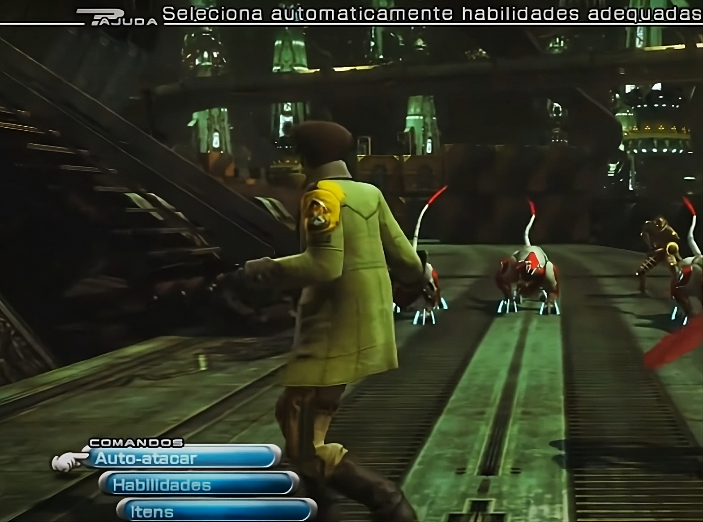

# Guia de Tradução - Final Fantasy XIII (Xbox Game Pass PC)

Olá! Este guia detalhado vai te ajudar a aplicar uma tradução no Final Fantasy XIII, especificamente a versão do Xbox Game Pass para PC, usando a ferramenta WhiteBinTools.  
Este processo envolve algumas etapas técnicas e requer atenção. Lembre-se, você está modificando arquivos de um jogo, então siga cada passo com cuidado!  

## ⚠️ AVISO CRÍTICO: FAÇA BACKUP DOS SEUS ARQUIVOS!
Antes de começar qualquer modificação, é **ABSOLUTAMENTE ESSENCIAL** que você faça uma cópia de segurança dos arquivos originais do jogo. Se algo der errado durante o processo, esse backup é a sua garantia para restaurar o jogo ao seu estado original sem ter que baixá-lo novamente (o que pode levar horas!).

### Localize a pasta do jogo:
Geralmente, jogos do Xbox Game Pass ficam em:  
`C:\XboxGames\FINAL FANTASY XIII\Content\white_data\sys\`  
*(O caminho pode variar um pouco dependendo de onde você instalou o jogo. Procure pela pasta `FINAL FANTASY XIII` dentro de `XboxGames` ou onde você configurou o Game Pass para instalar jogos.)*

### Copie os arquivos para um local seguro:
Crie uma nova pasta em um local fácil de lembrar (ex: `Meus Documentos\Backup FF13 Original`). 
## 🛠️ Ferramentas Essenciais

### WhiteBinTools:
Essa é a ferramenta que vamos usar para abrir e fechar os "pacotes" de arquivos do jogo.  
- Baixe a versão mais recente aqui: [https://github.com/Surihix/WhiteBinTools/releases](https://github.com/Surihix/WhiteBinTools/releases)  
- Após baixar, o arquivo virá compactado (zip). Extraia o arquivo `WhiteBinTools.exe` para uma pasta que você vai usar para este trabalho (sugiro criar uma pasta na raiz do seu HD, como `C:\FF13_Traducao`).

### Arquivos de Tradução:
Você já deve ter os arquivos da tradução. Eles foram fornecidos em .zip Eles são o coração deste processo! Certifique-se de que estão descompactados e prontos para serem copiados. 

## 🔒 Configurando o PowerShell para Rodar Scripts
Por segurança, o Windows PowerShell vem configurado para não executar scripts baixados da internet por padrão. Precisamos mudar essa configuração temporariamente para que você possa usar o script de atalho.

### Abra o PowerShell como Administrador:
- Na barra de pesquisa do Windows (menu Iniciar), digite "PowerShell".  
- Clique com o botão direito em "Windows PowerShell" e selecione "Executar como administrador".

### Mude a Política de Execução:
Na janela azul do PowerShell, digite o seguinte comando e pressione Enter:  
```
Set-ExecutionPolicy RemoteSigned
```
- Quando perguntado, digite `S` (ou `Y` para "Yes") e pressione Enter para confirmar a alteração.  
- **Importante**: Você pode reverter essa configuração para o padrão (`Restricted`) depois de terminar todo o processo, usando o comando `Set-ExecutionPolicy Restricted` no PowerShell como administrador.

## ⚙️ Script para Abrir PowerShell como Administrador (Atalho)
Este script é uma conveniência. Ele adiciona uma opção no menu de contexto (botão direito do mouse) que permite abrir o PowerShell como Administrador em qualquer pasta, facilitando o seu trabalho.

### Baixe o Script:
Salve-o em um arquivo chamado `Ativar_PowerShell_Admin_Menu_Contexto.ps1` em um local fácil de encontrar (ex: sua pasta Documentos).


### Execute o Script:
- Clique com o botão direito no arquivo `Ativar_PowerShell_Admin_Menu_Contexto.ps1` que você acabou de salvar.  
- Selecione "Executar com o PowerShell".  
- Siga as instruções na tela: você terá a opção de adicionar ou remover os atalhos. Escolha `1` para adicionar.

### A tool funciona!
Agora você pode utilizar o powershell com privilégios para executar os comandos.

## 🚀 Aplicando a Tradução: O Processo Manual
Este é o método mais seguro e controlável para aplicar a tradução.

### Abra o PowerShell como Administrador na sua Pasta de Trabalho:
- Vá até a pasta onde você extraiu o `WhiteBinTools.exe` (ex: `C:\FF13_Traducao`).  
- Clique com o botão direito em um espaço vazio dentro dessa pasta.  
- Se você usou o script acima, selecione "Abrir PowerShell aqui como Administrador". *(Caso contrário, pesquise "PowerShell" no Iniciar, execute como administrador e use `cd C:\LOCAL DO ARQUIVO\FF13_Traducao` para navegar até a pasta.)*

### Extraia os Arquivos Principais do Jogo (sys):
Execute o seguinte comando para extrair o conteúdo dos arquivos `.bin` principais do jogo para uma nova pasta (ex: `C:\FF13_Traducao\ArquivosExtraidos_SYS`):  
```
.\WhiteBinTools.exe -ff131 -u "C:\XboxGames\FINAL FANTASY XIII\Content\white_data\sys\filelistu.win32.bin" "C:\XboxGames\FINAL FANTASY XIII\Content\white_data\sys\white_imgu.win32.bin" "C:\FF13_Traducao\ArquivosExtraidos_SYS"
```
- Este processo pode levar alguns minutos. Aguarde até que ele termine.

### Copie os Arquivos de Tradução para a Pasta Extraída do sys:
- Vá até a pasta `C:\FF13_Traducao\ArquivosExtraidos_SYS` que foi criada.  
- Copie os arquivos da sua tradução limpa para dentro desta pasta, sobrescrevendo os arquivos originais quando solicitado. Tenha certeza de copiar apenas os arquivos modificados pela tradução para evitar corromper arquivos não relacionados.

### Reempacote os Arquivos Traduzidos no sys:
- Volte para a janela do PowerShell.  
- Execute o seguinte comando para injetar os arquivos modificados de volta nos `.bin` do jogo:  
```
.\WhiteBinTools.exe -ff131 -rmf "C:\XboxGames\FINAL FANTASY XIII\Content\white_data\sys\filelistu.win32.bin" "C:\XboxGames\FINAL FANTASY XIII\Content\white_data\sys\white_imgu.win32.bin" "C:\FF13_Traducao\ArquivosExtraidos_SYS"
```
- **ATENÇÃO**: Este passo de "injecting" (reempacotamento) pode levar **DEZENAS DE MINUTOS** (20-30 minutos ou mais), dependendo do seu computador. O PowerShell não dará muitos sinais de progresso, mas estará trabalhando. Não feche a janela do PowerShell nem interrompa o processo. Ele indicará quando terminar.

## 🧩 Entendendo a Pasta zone (E o Porquê da Tradução Parcial)
Se, após os passos acima, o jogo ainda não estiver totalmente traduzido (apenas menus, por exemplo), isso é esperado. Descobrimos que a tradução de Final Fantasy XIII está espalhada em mais lugares!  

- A tradução original que recuperamos (via engenharia reversa) continha arquivos não apenas na pasta `sys`, mas também na pasta `white_data\zone`.  
- A pasta `zone` do jogo está cheia de muitos outros pares de arquivos `filelistXXXX.win32.bin` e `white_imgXXXX.win32.bin`. É provável que textos de diálogos, itens, descrições e outros conteúdos estejam "empacotados" dentro desses arquivos na pasta `zone`.

### O que isso significa para você:
Para ter a tradução completa, você precisaria repetir o processo de extrair, copiar a tradução e reempacotar para cada par de arquivos `filelistXXXX.win32.bin` e `white_imgXXXX.win32.bin` na pasta `zone` que contenha conteúdo traduzido.

### Por que não há um script automatizado para isso?
Tentamos automatizar esse processo , mas descobrimos que é extremamente  propenso a falhas inconsistentes, podendo corromper o jogo facilmente. A precisão necessária para mapear qual arquivo `filelist` corresponde a qual `white_img` e quais arquivos de tradução vão em cada um é muito alta para ser garantida por um script genérico. Mas você pode fornecer este documento a uma IA e ela com certeza irá gerar um script a você. Não podemos nos responsabilizar por um erro que um script fornecido poderia dar.

### Por que não posso oferecer os arquivos do jogo já recompilados com a tradução?
Distribuir os arquivos do jogo com a tradução aplicada configuraria pirataria, pois envolveria a cópia e distribuição de software protegido por direitos autorais. Isso acarretaria problemas legais sérios para quem distribui, além de violar os termos de uso da Square Enix. Nosso guia apenas ensina o processo para que você mesmo aplique a tradução em sua cópia legítima do jogo.

### Se você quiser tentar a tradução completa:
- **Identifique os arquivos**: Compare os arquivos da sua tradução que vieram da pasta `zone` (do seu pacote de tradução) com os arquivos da pasta `C:\XboxGames\FINAL FANTASY XIII\Content\white_data\zone\`. Tente identificar quais `filelistXXXX.win32.bin` e `white_imgXXXX.win32.bin` correspondem aos arquivos da sua tradução.  
- **Repita o processo manual para cada par**:  
  - Crie uma pasta temporária para cada par (ex: `C:\FF13_Traducao\ArquivosExtraidos_ZONE_0001`).  
  - Use o `WhiteBinTools` para extrair (com o comando `-u`) o `filelist` e o `white_img` específicos da `zone` para essa pasta temporária.  
  - Copie os arquivos de tradução correspondentes para essa pasta temporária.  
  - Use o `WhiteBinTools` para reempacotar (com o comando `-rmf`) os mesmos `filelist` e `white_img` da `zone` de volta.  
- **CUIDADO**: Este é um processo demorado e de alto risco. Faça backups adicionais antes de tentar cada par, se possível.

## ✅ Conclusão e Como Reverter
- **Processo Concluído**: Após o processo de "injecting" (tanto do `sys` quanto, se você tentou, da `zone`) finalizar, feche a janela do PowerShell e tente iniciar o jogo.  
- **Reverter o Jogo**: Se quiser reverter,utilize seu backup. 

Este guia te dá as ferramentas e o conhecimento para aplicar a tradução do Final Fantasy XIII. É um processo que exige paciência e atenção, mas a recompensa é jogar em seu idioma! Se tiver dúvidas, procure comunidades de modding de jogos ou fóruns especializados.  

Boa sorte e aproveite o jogo!



# Bastidores da Tradução: Desafios e Agradecimentos

Este documento oferece um pouco de contexto sobre o trabalho que foi necessário para disponibilizar a tradução do Final Fantasy XIII no formato que você acabou de usar. É uma história de engenharia reversa, cuidado e, acima de tudo, respeito pela sua segurança.

## Os Desafios do Projeto

### Engenharia Reversa do Jogo
O processo para aplicar uma tradução em um jogo como Final Fantasy XIII não é simples. Ele exigiu uma engenharia reversa para entender como os arquivos do jogo, que pareciam ser um único bloco de dados, eram na verdade "pacotes" (os arquivos `.bin`). Foi um esforço para decifrar a estrutura interna e o formato de dados que a Square Enix utilizou, permitindo que a comunidade de modders criasse ferramentas para extrair e reempacotar esses arquivos.

### Lidando com o Instalador da Tradução
Um dos maiores desafios foi a situação do instalador da tradução original. Infelizmente, ao longo dos anos, alguns agentes maliciosos têm substituído os links de download de traduções antigas por versões infectadas.

O nosso trabalho foi recuperar os arquivos de tradução originais, garantindo que estivessem completamente limpos de qualquer malware, e separá-los em um formato seguro. Assim, você não precisa baixar um instalador executável de origem duvidosa, evitando qualquer risco para o seu computador. Sempre tenha cautela com instaladores de traduções que exigem permissões elevadas ou vêm de fontes desconhecidas.

## Agradecimentos e Aviso Legal

### Agradecimento à Comunidade
Todo este processo não teria sido possível sem o trabalho da comunidade. Gostaríamos de expressar um agradecimento especial a Surihix, o criador da ferramenta WhiteBinTools, que foi fundamental para conseguirmos manipular os arquivos do jogo e aplicar a tradução. O trabalho de desenvolvedores como ele é o que torna projetos como este viáveis.

### Disclaimer Legal
A tradução de Final Fantasy XIII para português é um projeto de fã, feito pela comunidade. Este trabalho não tem nenhuma afiliação oficial com a Square Enix ou qualquer uma de suas subsidiárias. Não reivindicamos a propriedade do jogo ou de qualquer um de seus ativos. Esta tradução é fornecida para fins de entretenimento, e não deve ser utilizada com intenção comercial. Todos os direitos autorais e marcas registradas pertencem aos seus respectivos donos.
